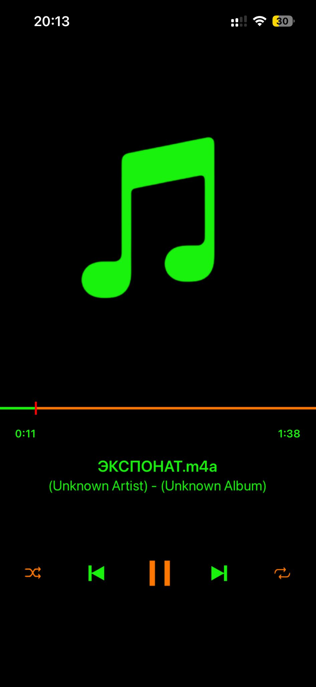

# foobar2000 green theme for iPhone 13
It's the updated skin for foobar2000 on iPhone 13. I changed it to my liking, i hope you will enjoy.

## Changes Made
- Optimized background color for OLED screens (rgb 0,0,0)
- Button colors are changed to green and orange (If the shuffle&repeat buttons are orange then it means that they are active)
- Second marker and position bar colors are changed to red and orange
- Solved the resizing issue while changing from landscape to portrait.

## How to install
Download all the files and make a zip archive, then change the file extension to .fbskin and upload it to your device.

## Screenshot

## Reference
- [Skinning](http://forum.foobar2000.com/forum/showthread.php?114-Skinning)
- [skin by Gr0m](http://forum.foobar2000.com/forum/showthread.php?364-skin-by-Gr0m/)
- [original repo](https://github.com/mkmark/foobar2000-mobile-skin-Simple-Dark)
